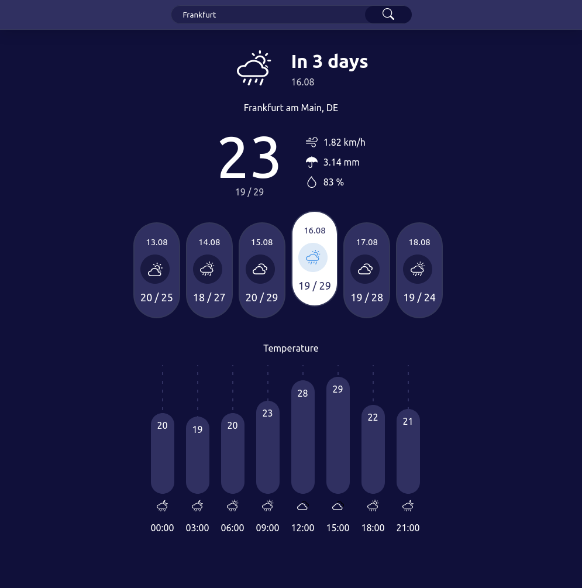
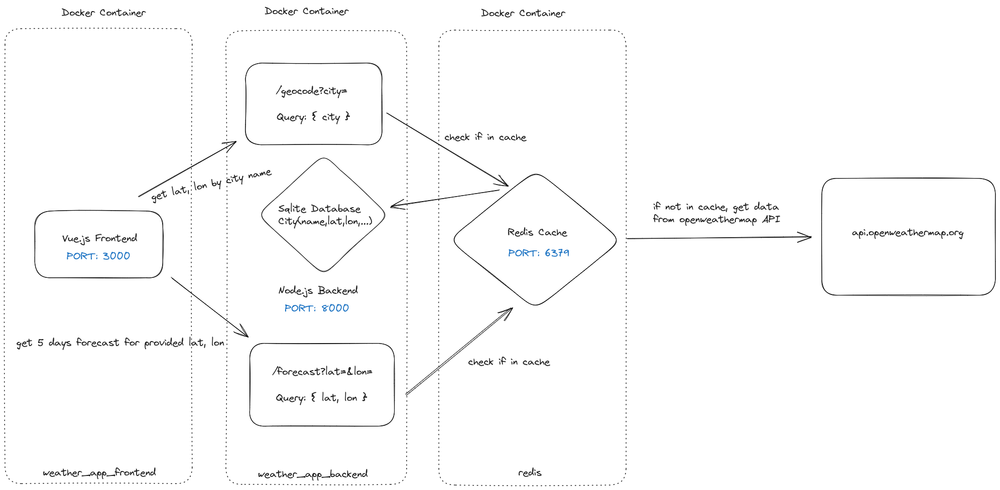

# weather-app

A simple weather application that shows you the current weather and a forecast for the next five days for a specific city.


Forecast and current weather dashboard:


Search results for city name:


## How to install

The weather data comes from the [OpenWeather](https://openweathermap.org/api) API. In order to use it, you have to rename `.env.example` to `.env` and add your generated `API_KEY` for [openweathermap.org](https://home.openweathermap.org/users/sign_up) to the file.

Create the SQlite database for cities with the `seed.sh` script in `backend/data`. (Read in [Performance and cost optimization](#performance-and-cost-optimization) why this step is required)

build and run project
```
docker-compose build
docker-compose up
```

## How it works

The weather application is separated into three parts: the frontend uses Vue.js, the backend is built with Express and a Redis docker container is used for caching.

Weather data is requested by latitude and longitude coordinates from the OpenWeather API, so every search request for a specific city weather needs to know these parameters first. This information is retrieved from the [OpenWeather Geocoding API](https://openweathermap.org/api/geocoding-api) and after that sent to the [OpenWeather 5 day forecast API](https://openweathermap.org/forecast5).

The data is then formatted and some parameters like average temperature and min/max temperature per day are calculated before it is sent to the frontend.

### Performance and cost optimization

The OpenWeather **API can be called 60 times per minute** in the free version and many calls can be repetitive (page reload, same search several times a day ...). Due to the fact that the latitude and longitude coordinates for a city do not change and forecast data is only updated every three hours, there had to be a method to prevent inefficient usage of the OpenWeather API resources.

#### SQlite cities database

Latitude and longitude coordinates do not change for a city. A database which holds lat and lon data for large cities worldwide will be queried first for each city weather search. Only if there are no matches found, the [OpenWeather Geocoding API](https://openweathermap.org/api/geocoding-api) will be called.

The data comes from [SimpleMaps.com](https://simplemaps.com/data) and is available under [World Cities Database](https://simplemaps.com/data/world-cities). This data was modified and saved as `world-cities.csv` and can be found in `backend/data`.

```
name,lat,lon,country,state
Tokyo,35.6897,139.6922,JP,Tōkyō
Jakarta,-6.1750,106.8275,ID,Jakarta
Delhi,28.6100,77.2300,IN,Delhi
Guangzhou,23.1300,113.2600,CN,Guangdong
Mumbai,19.0761,72.8775,IN,Mahārāshtra
Manila,14.5958,120.9772,PH,Manila
Shanghai,31.1667,121.4667,CN,Shanghai
Sao Paulo,-23.5500,-46.6333,BR,São Paulo
...
```

Execute the `seed.sh` script to create a SQlite database with this data. The database is created in the same directory as `cities.db`.

#### Redis caching database

The `docker-compose.yml` creates a Redis database container.

When requesting data from OpenWeather, the Redis database is used to cache the response. Geocoding and Forecast responses from OpenWeather will be cached. If a request is found in cache, the OpenWeather API will not be called and the data will be served from here.

Getting the data from the cache is implemented as an Express middleware function.

Geocoding data is cached for **1 day** and forecast data for **1 hour**.

### System design

The following graph describes the structure of this application. It is explained step by step below.



|container name|port|role|
|---|---|---|
|weather_app_frontend|3000|frontend|
|weather_app_backend|8000|backend|
|redis|6379|cache|

**1. get coordinates for city**
1. A city name is typed into the frontend.
2. The city name is sent to the backend route `/geocode?city={city}`.
3. The Express middleware checks if this request was stored in the Redis cache.
4. If it is found in the Redis cache, the coordinates for this city will be sent to the frontend.
5. If the query is not found, the city is searched in the cities database.
6. Return the coordinates if the city is found in the cities database.
7. If the city is not found in the SQlite database, the [OpenWeather Geocoding API](https://openweathermap.org/api/geocoding-api) is called.
8. The response is formatted and sent to the frontend.

**2. get forecast for city**
1. A city is selected on the frontend and its weather forecast is requested.
2. The forecast request is sent to the backend route `/forecast?lat={lat}&lon={lon}`.
3. The Express middleware checks if this request was stored in the Redis cache.
4. If it is found in the Redis cache, the weather forecast for this city will be sent to the frontend.
5. If the query is not found, the [OpenWeather 5 day forecast API](https://openweathermap.org/forecast5) is called.
6. The response is formatted, some parameters are calculated and sent to the frontend.


## Future improvements

- [x] Instead of caching the OpenWeather geocode response, add the data to the SQlite cities database, because Latitude and longitude coordinates never change.
- [ ] Persist cities database, so that added cities will be saved properly.

## Resources

* [SimpleMaps.com - World Cities Database](https://simplemaps.com/data/world-cities)
